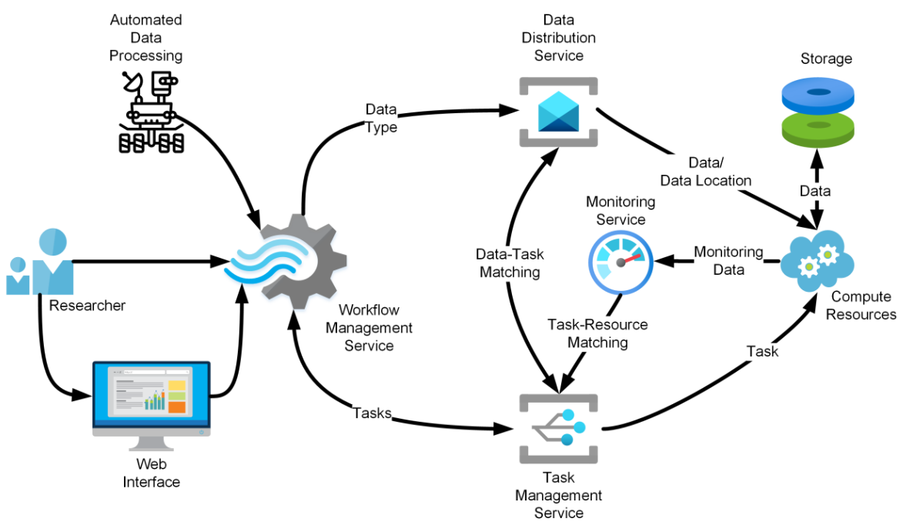

---
hide:
  - toc
---

# Event Workflow Management Service

The main goal of the Event Workflow Management Service (EWMS) project is to
advance the state of task scheduling and management by combining the
handling of small, discrete events with the computing scale of modern
scientific collaborations.

EWMS is a workflow management system built on
[HTCondor](https://htcondor.readthedocs.io) designed to process billions of
fine grained events.  It optimizes scheduling to fit work units into smaller
resource envelopes and pipelines data transfer.

## EWMS Architecture

* **Workflow Management Service**: the control layer, user interface, and
  data provenance provider for workflows.
* **Data Distribution Service**: uses message queues to manage O(100 TB)
  of data across millions of events per day.
* **Task Management Service**: manage execution of task instances for each
  workflow on the compute resources.
* **Monitoring Service**: monitors the progress of workflows and each
  component of EWMS, to better optimize throughput.

*Above: Diagram of EWMS service*
