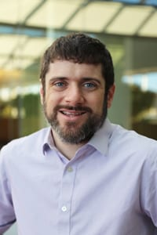
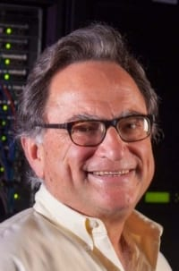

# People

The Event Workflow Management Service is brought to you by the following:

## Leadership

### Benedikt Riedel

Global Computing Manager, [IceCube Neutrino Observatory](https://icecube.wisc.edu)

University of Wisconsin--Madison

### Brian Bockelman

Investigator, [Research Computing, Morgridge Institute](https://morgridge.org/research/research-computing/)

University of Wisconsin--Madison

### Miron Livney

Director, [Center for High Throughput Computing](https://chtc.cs.wisc.edu/)

Technical Director, [Open Science Grid](https://opensciencegrid.org/)

University of Wisconsin--Madison

## Other Project Members

* David Schultz, IceCube Neutrino Observatory,
  University of Wisconsin--Madison

* Ric Evans, IceCube Neutrino Observatory,
  University of Wisconsin--Madison
